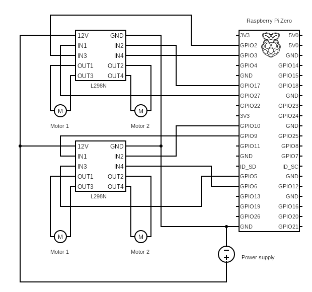

# Readme
This is a ROS package meant to controll DC electric grippers with a node runnning on a raspberry pi

## Prerequisites
1. **ROS**
   
This code is meant to run on **ROS noetic** or **ROS2 humble**
You can either install ROS on bare metal using the instructions found here:
  - http://wiki.ros.org/ROS/Installation (Noetic)
  - https://docs.ros.org/en/humble/Installation.html (Humble)

Or you can install it in a Docker container, keep in mind that **ROS2 humble only supports 64-bit operating systems**

 **Noetic**
  - ```bash
    docker pull ros:noetic-ros-core
    ``` 
  **Humble**
  - ```bash
    docker pull arm64v8/ros:humble-ros-base
    ```
2. **ROS workspace**
   
To run a package we need a ROS workspace
```
ros_ws
|__src
```
You can create and build a workspace by following these instructions:
- http://wiki.ros.org/catkin/Tutorials/create_a_workspace
- https://docs.ros.org/en/humble/Tutorials/Beginner-Client-Libraries/Creating-A-Workspace/Creating-A-Workspace.html

## Wiring
Below is the wiring diagram of how the components should be interconnected to ensure plug and play operation.


## Installation
1. Clone this repository into the `src` directory of your workspace
   ```bash
   git clone https://github.com/gaspersavle/gripper_driver.git
   ```
2. Checkout the branch corresponding to your device/ROS version
   - RPi4 humble
     ```bash
     git checkout RPi4
     ```
   - RPi4 noetic
     ```bash
     git checkout hack-ros1
     ```
   - RPi zero
     ```bash
     git checkout pizero
     ```
   -  RPi4 with my self made H-bridge
     ```bash
     git checkout hack
     ```
     
3. Build the package
   ```bash
   colcon build --packages-select gripper_driver
   ```
4. Source the instalation directory
   ```bash
   source ros_ws/install/setup.bash
   ```
5. Run the package
   ```bash
   ros2 run gripper_driver service
   ```
  
